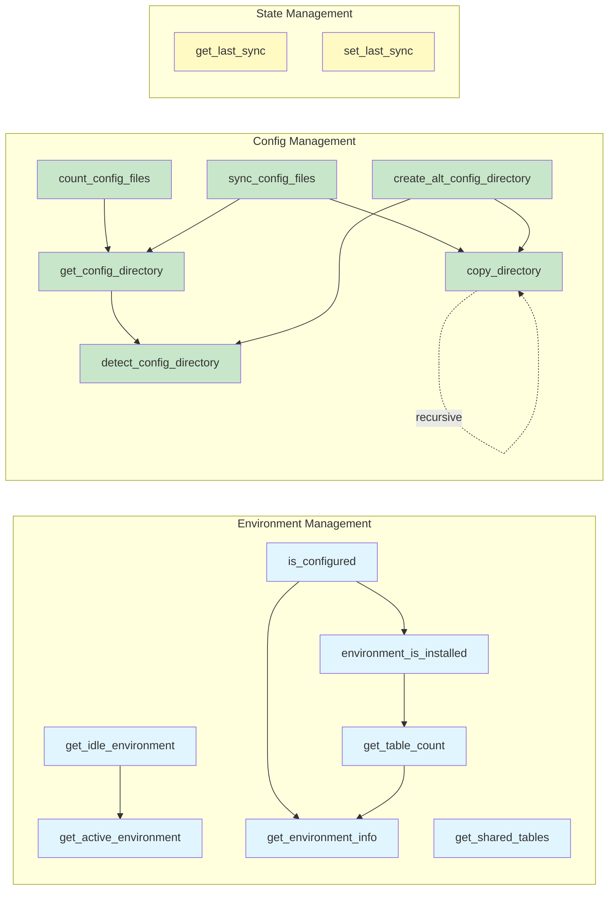
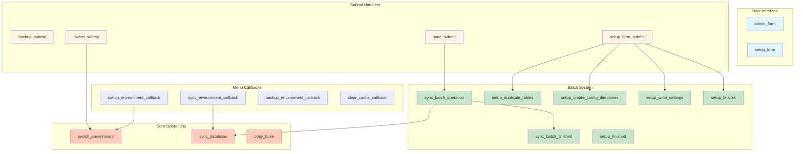
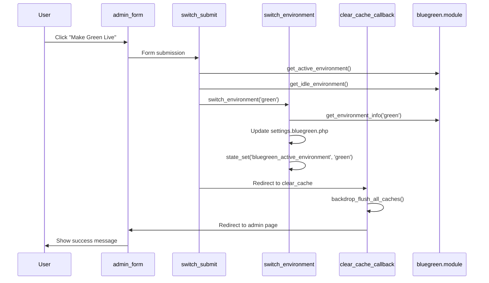
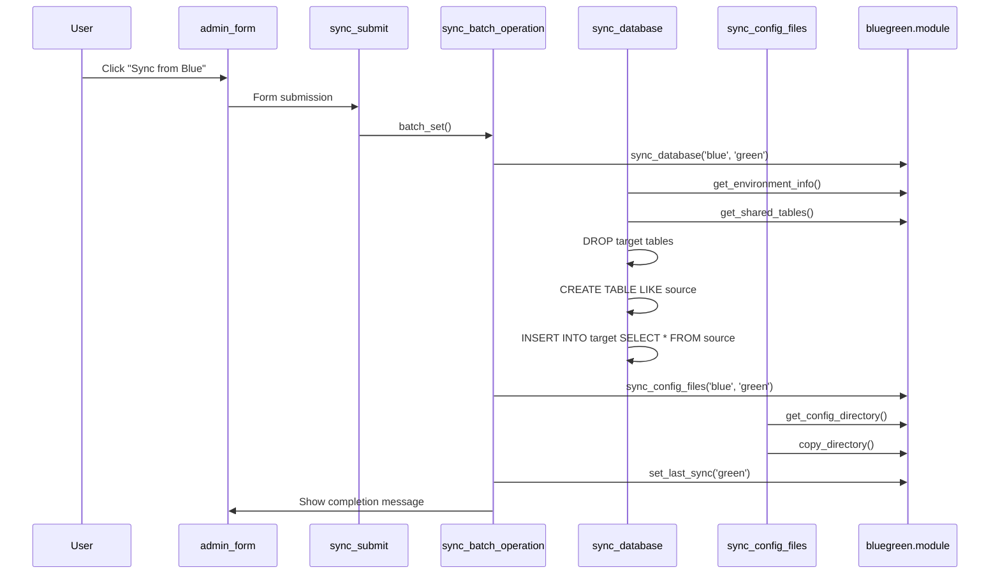
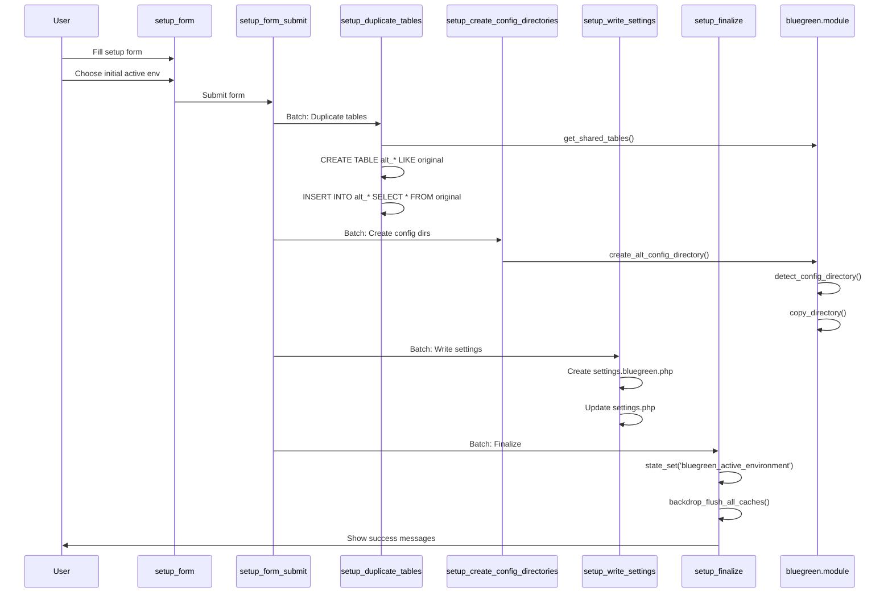

# Blue-Green Module - Complete Architecture Diagram

Visual representation of all functions across all files and their relationships.

## Complete System Architecture

```mermaid
graph TB
    %% Styling
    classDef moduleFunc fill:#e1f5ff,stroke:#0066cc,stroke-width:2px
    classDef adminFunc fill:#fff4e1,stroke:#ff9900,stroke-width:2px
    classDef installFunc fill:#ffe1e1,stroke:#cc0000,stroke-width:2px
    classDef batchFunc fill:#e8f5e9,stroke:#4caf50,stroke-width:3px

    subgraph "bluegreen.module (Core)"
        %% Environment Functions
        get_active[get_active_environment]:::moduleFunc
        get_env_info[get_environment_info]:::moduleFunc
        is_configured[is_configured]:::moduleFunc
        get_idle[get_idle_environment]:::moduleFunc
        get_shared[get_shared_tables]:::moduleFunc
        get_table_count[get_table_count]:::moduleFunc
        env_installed[environment_is_installed]:::moduleFunc

        %% Config Functions
        detect_config[detect_config_directory]:::moduleFunc
        get_config_dir[get_config_directory]:::moduleFunc
        count_config[count_config_files]:::moduleFunc
        copy_dir[copy_directory]:::moduleFunc
        sync_config[sync_config_files]:::moduleFunc
        create_alt[create_alt_config_directory]:::moduleFunc

        %% State Functions
        get_last_sync[get_last_sync]:::moduleFunc
        set_last_sync[set_last_sync]:::moduleFunc
    end

    subgraph "bluegreen.admin.inc (Admin UI)"
        %% Forms
        admin_form[admin_form]:::adminFunc
        setup_form[setup_form]:::adminFunc

        %% Submit Handlers
        backup_submit[backup_submit]:::adminFunc
        sync_submit[sync_submit]:::adminFunc
        switch_submit[switch_submit]:::adminFunc
        setup_submit[setup_form_submit]:::adminFunc

        %% Callbacks
        switch_callback[switch_environment_callback]:::adminFunc
        sync_callback[sync_environment_callback]:::adminFunc
        backup_callback[backup_environment_callback]:::adminFunc
        clear_cache_callback[clear_cache_callback]:::adminFunc

        %% Core Operations
        sync_database[sync_database]:::adminFunc
        copy_table[copy_table]:::adminFunc
        switch_environment[switch_environment]:::adminFunc

        %% Batch Operations
        sync_batch_op[sync_batch_operation]:::batchFunc
        sync_batch_finish[sync_batch_finished]:::batchFunc
        setup_dup_tables[setup_duplicate_tables]:::batchFunc
        setup_create_config[setup_create_config_directories]:::batchFunc
        setup_write_settings[setup_write_settings]:::batchFunc
        setup_finalize[setup_finalize]:::batchFunc
        setup_finished[setup_finished]:::batchFunc
    end

    subgraph "bluegreen.install (Install/Uninstall)"
        requirements[requirements]:::installFunc
        install[install]:::installFunc
        uninstall[uninstall]:::installFunc
    end

    %% Cross-file relationships - Admin to Module
    admin_form --> is_configured
    admin_form --> get_active
    admin_form --> get_idle
    admin_form --> get_env_info
    admin_form --> env_installed
    admin_form --> get_last_sync

    setup_form --> is_configured

    switch_submit --> get_active
    switch_submit --> get_idle
    switch_submit --> switch_environment

    sync_batch_op --> sync_database
    sync_batch_op --> sync_config
    sync_batch_op --> set_last_sync

    sync_callback --> sync_database
    sync_callback --> sync_config
    sync_callback --> set_last_sync

    switch_callback --> switch_environment

    setup_dup_tables --> get_shared
    setup_create_config --> create_alt
    setup_create_config --> count_config

    %% Within-module relationships
    get_idle --> get_active
    is_configured --> get_env_info
    is_configured --> env_installed
    env_installed --> get_table_count
    get_table_count --> get_env_info

    get_config_dir --> detect_config
    count_config --> get_config_dir
    sync_config --> get_config_dir
    sync_config --> copy_dir
    create_alt --> detect_config
    create_alt --> copy_dir
    copy_dir -.recursive.-> copy_dir

    %% Within-admin relationships
    sync_database --> get_env_info
    sync_database --> get_shared
    switch_environment --> get_env_info

    sync_submit --> sync_batch_op
    setup_submit --> setup_dup_tables
    setup_submit --> setup_create_config
    setup_submit --> setup_write_settings
    setup_submit --> setup_finalize
```

## File-by-File Breakdown

### bluegreen.module (18 functions)

### bluegreen.admin.inc (20 functions)

## User Action Flow Diagrams

### Environment Switch Flow

### Database Sync Flow

### Initial Setup Flow

## Function Complexity Analysis

### High Complexity (5+ function calls)
- **admin_form()** - Calls 7 module functions
- **sync_batch_operation()** - Calls 3 functions + manages batch state
- **setup_create_config_directories()** - Calls 5 functions

### Medium Complexity (2-4 function calls)
- **is_configured()** - Calls 2 functions
- **sync_config_files()** - Calls 2 functions
- **create_alt_config_directory()** - Calls 2 functions
- **switch_submit()** - Calls 3 functions
- **sync_database()** - Calls 2 functions + DB operations

### Low Complexity (0-1 function calls)
- Most getter functions (get_active_environment, get_shared_tables, etc.)
- State management functions
- Simple callbacks

## Critical Paths

### Most Important Functions (Called by Many)
1. **get_environment_info()** - Used throughout system for DB config
2. **get_active_environment()** - Used by UI and operations
3. **is_configured()** - Gate-keeper for functionality
4. **get_shared_tables()** - Critical for data integrity during sync

### Risk Areas (Single Point of Failure)
1. **switch_environment()** - File write operations, state changes
2. **sync_database()** - Large data operations, DROP/CREATE tables
3. **setup_duplicate_tables()** - Initial setup, creates all alt_ tables

## Legend

- 🔵 **Blue** - bluegreen.module functions
- 🟠 **Orange** - bluegreen.admin.inc functions
- 🔴 **Red** - bluegreen.install functions
- 🟢 **Green** - Batch operation functions
- **Solid lines** - Direct function calls
- **Dotted lines** - Recursive calls

---

**Generated:** 2025-11-08
**Total Functions Mapped:** 47 across 3 files
