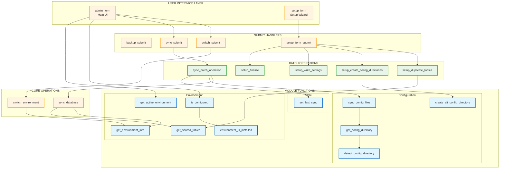
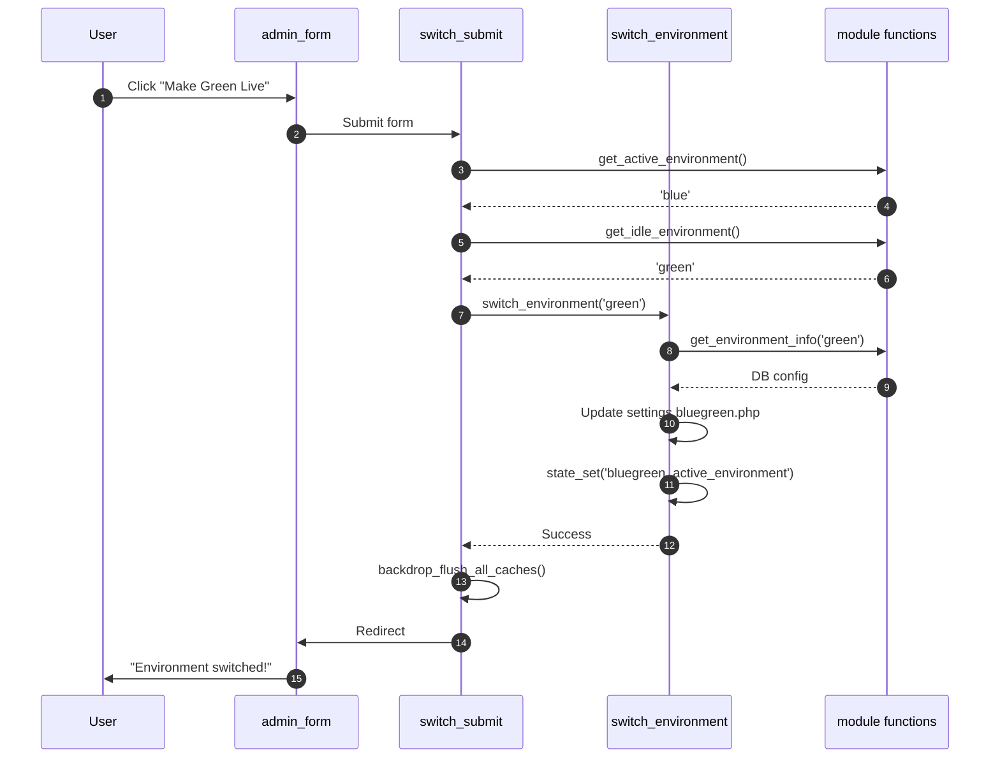
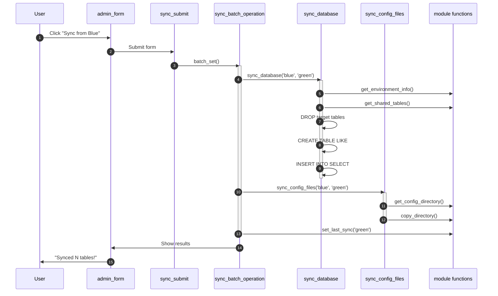
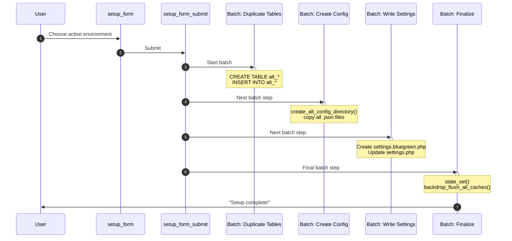
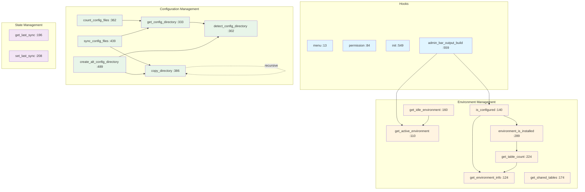
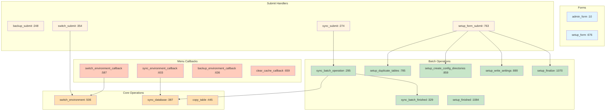
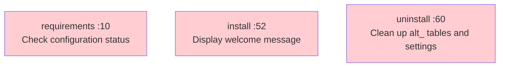
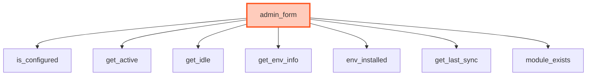
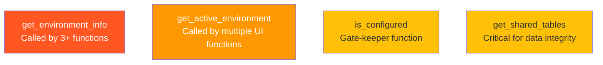
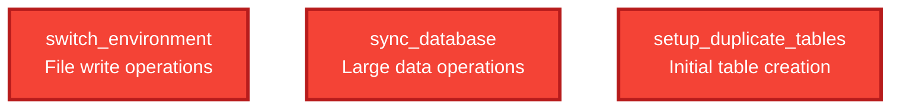

# Blue-Green Module - Complete Architecture Diagram

Visual representation of all functions across all files and their relationships.

## Complete System Overview

## Environment Switch Flow

## Database Sync Flow

## Initial Setup Flow

## Module Function Groups

### bluegreen.module (18 functions)

### bluegreen.admin.inc (20 functions)

### bluegreen.install (3 functions)

## Function Complexity Analysis

### High Complexity (5+ calls)

### Medium Complexity (2-4 calls)
- **sync_batch_operation** → sync_database, sync_config_files, set_last_sync
- **is_configured** → get_environment_info, environment_is_installed
- **switch_submit** → get_active, get_idle, switch_environment

### Low Complexity (0-1 calls)
- Getter functions (get_active_environment, get_shared_tables, etc.)
- State functions (get_last_sync, set_last_sync)
- Simple callbacks

## Critical Paths

### Most Called Functions

### Risk Areas (Single Point of Failure)

## Legend

- 🔵 **Light Blue** - bluegreen.module functions
- 🟠 **Orange** - bluegreen.admin.inc functions (forms, handlers)
- 🟢 **Green** - Batch operation functions
- 🔴 **Red** - bluegreen.install functions
- **Solid lines** - Direct function calls
- **Dotted lines** - Recursive calls
- **Thick borders** - High-risk or high-complexity functions

## Summary Statistics

| Metric | Count |
|--------|-------|
| **Total Functions** | 47 |
| **bluegreen.module** | 18 |
| **bluegreen.admin.inc** | 20 |
| **bluegreen.install** | 3 |
| **Sample modules** | 6 |
| **Hook Implementations** | 10 |
| **Menu Callbacks** | 7 |
| **Batch Operations** | 5 |
| **Cross-file Dependencies** | 15+ |

---

**Generated:** 2025-11-08
**Total Functions Mapped:** 47 across 3 core files
**Diagram Format:** Mermaid (renders on GitHub)
