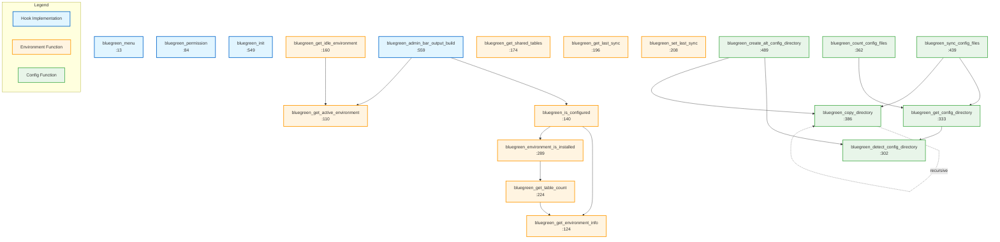

# Blue-Green Module - Function Call Diagram

This diagram shows all functions in `bluegreen.module` and their call relationships.

## Interactive Call Graph



## Function Groups

### 🔵 Hook Implementations (Blue)
Functions that implement Backdrop CMS hooks:
- **bluegreen_menu** (:13) - Defines admin pages and menu items
- **bluegreen_permission** (:84) - Defines access permissions
- **bluegreen_init** (:549) - Loads CSS on admin pages
- **bluegreen_admin_bar_output_build** (:559) - Adds environment indicator to admin bar

### 🟠 Environment Functions (Orange)
Functions that manage environment information and state:
- **bluegreen_get_active_environment** (:110) - Returns active env name
- **bluegreen_get_environment_info** (:124) - Gets database config
- **bluegreen_is_configured** (:140) - Checks if setup complete
- **bluegreen_get_idle_environment** (:160) - Returns idle env name
- **bluegreen_get_shared_tables** (:174) - Lists shared tables
- **bluegreen_get_last_sync** (:196) - Gets last sync timestamp
- **bluegreen_set_last_sync** (:208) - Sets sync timestamp
- **bluegreen_get_table_count** (:224) - Counts tables in env
- **bluegreen_environment_is_installed** (:289) - Checks if env has tables

### 🟢 Configuration Functions (Green)
Functions that manage configuration directories:
- **bluegreen_detect_config_directory** (:302) - Finds active config dir
- **bluegreen_get_config_directory** (:333) - Gets env config path
- **bluegreen_count_config_files** (:362) - Counts config files
- **bluegreen_copy_directory** (:386) - Recursively copies directories
- **bluegreen_sync_config_files** (:439) - Syncs config between envs
- **bluegreen_create_alt_config_directory** (:489) - Creates green config dir

## Call Chains

### Longest Call Chains

**Admin Bar Display:**
```
bluegreen_admin_bar_output_build
  └─> bluegreen_is_configured
      ├─> bluegreen_get_environment_info
      └─> bluegreen_environment_is_installed
          └─> bluegreen_get_table_count
              └─> bluegreen_get_environment_info
```

**Config File Syncing:**
```
bluegreen_sync_config_files
  ├─> bluegreen_get_config_directory
  │   └─> bluegreen_detect_config_directory
  └─> bluegreen_copy_directory
      └─> bluegreen_copy_directory (recursive)
```

**Creating Alternate Config:**
```
bluegreen_create_alt_config_directory
  ├─> bluegreen_detect_config_directory
  └─> bluegreen_copy_directory
      └─> bluegreen_copy_directory (recursive)
```

### Independent Functions (No Dependencies)

These functions don't call other bluegreen functions:
- `bluegreen_menu()`
- `bluegreen_permission()`
- `bluegreen_get_active_environment()`
- `bluegreen_get_environment_info()`
- `bluegreen_get_shared_tables()`
- `bluegreen_get_last_sync()`
- `bluegreen_set_last_sync()`
- `bluegreen_init()`
- `bluegreen_detect_config_directory()`

## Dependency Analysis

### Most Called Functions (Utility Functions)
1. **bluegreen_get_environment_info()** - Called by 3 functions
2. **bluegreen_detect_config_directory()** - Called by 2 functions
3. **bluegreen_get_config_directory()** - Called by 2 functions
4. **bluegreen_copy_directory()** - Called by 2 functions (plus itself)

### Most Dependent Functions (Complex Functions)
1. **bluegreen_is_configured()** - Calls 2 other functions
2. **bluegreen_sync_config_files()** - Calls 2 other functions
3. **bluegreen_create_alt_config_directory()** - Calls 2 other functions

### Recursive Functions
- **bluegreen_copy_directory()** - Recursively calls itself to copy subdirectories

## Function Categories by Purpose

### Data Retrieval (Read-only)
- `bluegreen_get_active_environment()`
- `bluegreen_get_environment_info()`
- `bluegreen_get_idle_environment()`
- `bluegreen_get_shared_tables()`
- `bluegreen_get_last_sync()`
- `bluegreen_get_table_count()`
- `bluegreen_environment_is_installed()`
- `bluegreen_detect_config_directory()`
- `bluegreen_get_config_directory()`
- `bluegreen_count_config_files()`

### Data Modification (Write operations)
- `bluegreen_set_last_sync()`
- `bluegreen_copy_directory()`
- `bluegreen_sync_config_files()`
- `bluegreen_create_alt_config_directory()`

### Validation/Check Functions
- `bluegreen_is_configured()`
- `bluegreen_environment_is_installed()`

### UI/Display Functions
- `bluegreen_menu()`
- `bluegreen_permission()`
- `bluegreen_init()`
- `bluegreen_admin_bar_output_build()`

---

**Note:** The diagram above uses Mermaid syntax and will render as an interactive graph on GitHub and other platforms that support Mermaid diagrams.
